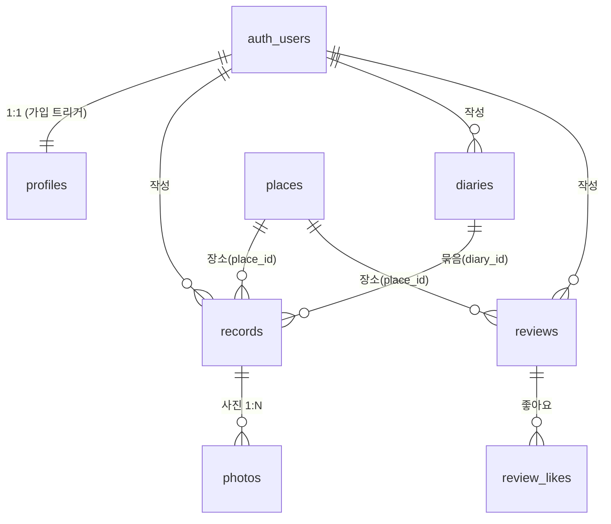

# DB 스키마 정독 가이드 (학습용)

> 실제 스키마는 `supabase/migrations/20260626000000_init.sql` **한 파일**.
> 이 문서는 그 파일을 **이해하기 쉽게 읽는 순서와 해설**을 담는다(마이그레이션과 분리된 학습 자료).

---

## 0. 먼저 — 마이그레이션 파일은 왜 한 파일인가
- CLI 마이그레이션은 **타임스탬프 파일이 순서대로 누적**된다. 한 파일 = "한 시점의 변경".
- 적용된 파일은 **수정/분할하지 않는다**(이력과 어긋남). 변경은 항상 **새 파일 추가**: `supabase migration new <name>`.
- 그래서 `..._init.sql`은 "초기 스키마 1개"일 뿐. Phase 3에서 Storage·컬럼이 생기면 **두 번째 마이그레이션 파일**이 생긴다.

---

## 1. 큰 그림 — "두 개의 세계"

```
[ 비공개 세계 ]  내 기록 — 나만 본다 (RLS: 본인만)
   profiles → records → photos
                 │
                 └→ diaries (일기로 묶음)

[ 공개 세계 ]  장소 후기 — 누구나 읽는다 (RLS: 공개읽기/본인쓰기)
   places → reviews → review_likes

[ 공용 마스터 ]
   places  (TourAPI 캐시 — 양쪽이 참조하는 장소 사전)
```

핵심 통찰: **`places`(장소)는 공용 사전**이고, 거기에 내 **비공개 기록(records)**과 남들도 보는 **공개 후기(reviews)**가 각각 매달린다. 이 분리가 "일기는 비공개, 후기만 공개"라는 우리 정체성의 뼈대다.

---

## 2. 관계도 (ER)



---

## 3. 읽는 순서 (이 순서로 파일을 보면 막힘없이 이해됨)

> SQL의 *정의 순서*는 FK 때문에 살짝 다르지만(참조 대상이 먼저 와야 함),
> **개념 이해는 아래 순서**가 가장 자연스럽다.

| 순서 | 대상 | 한 줄 |
|---|---|---|
| ① | `set_updated_at()` 함수 | 모든 테이블이 공유하는 "수정시각 자동 갱신" 도구 |
| ② | **profiles** | 사용자 정체성 (auth.users 1:1, 가입 시 트리거 자동 생성) |
| ③ | **places** | TourAPI 장소 캐시 — 독립적 마스터, 모두가 참조 |
| ④ | **records** | 코어: 장소 단위 기록 (places·diaries 참조) |
| ⑤ | **photos** | records에 매달린 사진 1:N |
| ⑥ | **diaries** | records를 묶어 만든 일기 |
| ⑦ | **reviews** / **review_likes** | 공개 후기 + 좋아요 |
| ⑧ | **RLS 정책 블록** | 위 전부의 "누가 보고/쓰는가" 보안 규칙 |

---

## 4. 테이블별 해설

### ② profiles — 사용자
- **목적**: `auth.users`(Supabase가 관리하는 인증 테이블)와 **1:1**로 붙는 앱 프로필.
- **핵심 컬럼**: `id`(=auth.users.id, PK이자 FK), `nickname`, `locale`('ko' 기본).
- **트리거**: `handle_new_user()` — 회원가입(auth.users INSERT) 시 profiles 행을 자동 생성. (`security definer`라 RLS 우회 삽입)
- **왜 분리?** auth.users는 직접 못 건드리니, 앱용 정보(닉네임 등)는 별도 테이블에.

### ③ places — 장소(TourAPI 캐시)
- **목적**: TourAPI에서 받은 장소를 캐싱해 재사용. 비공개/공개 양쪽이 참조하는 **공용 사전**.
- **핵심 컬럼**: `content_id`(TourAPI 고유 id, **unique**), `title`, `lat`/`lng`, `overview`(공식 개요), `cat1~3`, `raw`(원본 jsonb).
- **쓰기 주체**: 일반 사용자는 못 쓴다 → **서버(secret 키)만** 캐시에 기록(RLS에서 쓰기 정책을 안 줌).

### ④ records — 기록 (코어)
- **목적**: "한 장소 = 한 코스" 단위의 비공개 기록. 메모·질문답변·AI정리가 여기 모인다.
- **핵심 컬럼**: `user_id`(주인), `place_id`(어느 장소 — 확정 전엔 null), `diary_id`(어느 일기로 묶였나 — null 가능), `captured_at`(대표 촬영시각 = **타임라인 정렬키**), `memo`, `answers`(jsonb `[{questionId,question,text}]`), `ai_summary`, `ai_tags`, `manual_location`(EXIF 없을 때), `weather`.
- **관계**: places·diaries를 참조(둘 다 `on delete set null` — 장소/일기가 지워져도 기록은 남음).

### ⑤ photos — 사진 (records 1:N)
- **목적**: 한 장소에서 여러 장 찍는 걸 담기 위해 records와 분리(A안).
- **핵심 컬럼**: `record_id`(부모, `on delete cascade` — 기록 지우면 사진도), `url`(Storage), `captured_at`/`lat`/`lng`(사진별 EXIF), `sort_order`, `media_type`('photo', 영상 확장 예약).
- **`user_id`가 또 있는 이유**: RLS를 `auth.uid() = user_id`로 단순하게 걸기 위해(부모 조인 없이).

### ⑥ diaries — 일기
- **목적**: records를 시간·장소순으로 묶어 만든 최종 일기. **늘 비공개**.
- **핵심 컬럼**: `user_id`, `tone`(`plain`/`emotional`/`humor` — CHECK 제약), `body`(본문), `diary_date`.
- **방향**: records가 `diary_id`로 일기를 가리킨다(일기 1 : 기록 N).

### ⑦ reviews / review_likes — 공개 후기
- **reviews**: 장소별 공개 후기. `place_id`(어느 장소), `content`, `rating`(1~5 CHECK), **`unique(user_id, place_id)`**(한 사람당 장소별 1개).
- **review_likes**: 좋아요. **복합 PK `(review_id, user_id)`** 로 같은 사람의 중복 좋아요를 원천 차단.

---

## 5. RLS 보안 모델 (제일 중요)
RLS = "행 단위 접근 규칙". 누락 시 남의 일기가 노출되는 사고.

| 테이블 | 읽기 | 쓰기 |
|---|---|---|
| profiles | 공개(작성자 표시용) | 본인만 |
| places | 공개 | **서버(secret)만** |
| records / photos / diaries | **본인만** | **본인만** |
| reviews | 공개 | 본인만 |
| review_likes | 공개(카운트) | 본인만(토글) |

읽는 법: 파일 맨 아래 `enable row level security` + `create policy ...` 블록.
- `using (...)` = **읽기/수정/삭제** 시 통과 조건
- `with check (...)` = **삽입/수정** 시 들어갈 값의 조건
- `auth.uid()` = 현재 로그인 사용자 id. 이게 `user_id`와 같아야 통과 = "본인만".

---

## 6. 직접 확인하는 법
- **대시보드 → Table Editor**: 테이블·컬럼·관계를 눈으로.
- **대시보드 → Database → Roles/Policies**: RLS 정책 확인.
- **SQL Editor**에서:
  ```sql
  -- 테이블 목록
  select table_name from information_schema.tables where table_schema='public';
  -- 특정 테이블 컬럼
  select column_name, data_type, is_nullable
  from information_schema.columns where table_name='records' order by ordinal_position;
  -- RLS 정책 목록
  select tablename, policyname, cmd from pg_policies where schemaname='public';
  ```
