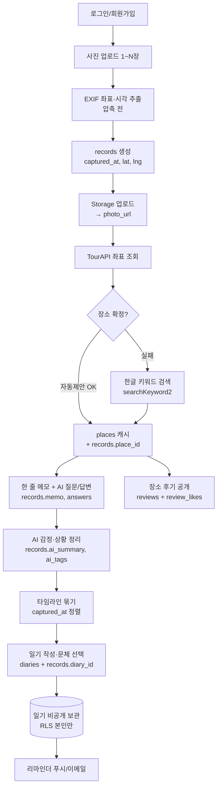

# 앱 흐름 → 데이터 매핑 (스키마 검증용)

> 목적: 기획서 §3 핵심 흐름의 각 단계가 **어떤 테이블/컬럼을 읽고(R)/쓰는지(W)** 매핑해 스키마를 검증한다.
> 무거운 설계 문서가 아니라, 스키마 구멍을 찾고 이후 화면 명세로 쓰기 위한 가벼운 지도.

## 흐름도

## 단계별 CRUD 매핑

| # | 단계 | 동작 | 테이블 · 컬럼 |
|---|---|---|---|
| 1 | 회원가입/로그인 | 트리거로 프로필 생성 | **profiles** W(`id`,`nickname`) |
| 2 | 사진 업로드 | EXIF 추출(클라) → 기록·사진 생성 | **records** W(`captured_at` 대표) · **photos** W(`captured_at`,`lat`,`lng`,`media_type`,`sort_order`) |
| 3 | 사진 저장 | Storage 업로드 → URL 기록 | Storage W · **photos** W(`url`) |
| 4 | 장소 제안 | 좌표로 TourAPI 조회 → 캐시 | **places** R/W(서버 secret) · **records** W(`place_id`) |
| 4b | 장소 확정 실패 | 한글 키워드 검색 → 확정 | **places** R/W · **records** W(`place_id`) |
| 5 | 메모·질문 | 메모 입력 + AI 질문/답변 | **records** W(`memo`,`answers`) |
| 6 | AI 정리 | 메모+답변 → 정리 | **records** W(`ai_summary`,`ai_tags`) |
| 7 | 타임라인 | captured_at 정렬로 묶기 | **records** R(`captured_at`,`place_id`) |
| 8 | 일기 작성 | 문체 선택 → 본문 생성·저장 | **diaries** W(`tone`,`body`,`diary_date`) · **records** W(`diary_id`) |
| 9 | 일기 보관 | 늘 비공개 | **diaries** R (RLS 본인만) |
| 10 | 후기 공개 | 장소별 후기·좋아요 | **reviews** R/W · **review_likes** R/W |
| 11 | 리마인더 | "어제 다녀온 OO" 알림 | **records** R(어제 날짜) · *(발송이력 테이블?)* |

## 🔎 매핑으로 드러난 스키마 구멍/결정

1. **[확정 ✅ A안] 장소당 사진 N장** — 별도 **`photos` 테이블(records 1:N)** 채택. 사진별 `url`·EXIF(`captured_at`,`lat`,`lng`)·`media_type`·`sort_order` 보관, 메모·질문·AI정리는 `records`(장소)에 한 번. RLS 본인만. 마이그레이션 반영 완료.
2. **[확정 ✅] answers 형태** — `[{questionId, question, text}]`로 저장(질문 텍스트도 보존). 컬럼 코멘트 반영.
3. **[후순위] 리마인더 발송 이력** — MVP는 records(어제 날짜)에서 계산. 중복 발송 방지 `reminders` 테이블은 Phase 7에서 필요 시 추가.
